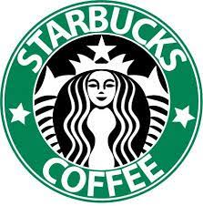

# landingPage

Landing page to the new coffee shop in saul elkind!
 
# Indice
 
[Projeto de portfólio pessoal](#projeto-de-portf%C3%B3lio-pessoal)
 
 
[Descrição](#descri%C3%A7%C3%A3o)
 
 
[Funcionalidades](#funcionalidades)
 
 
[Tecnologias utilizadas](#tecnologias-utilizadas)
 
 
[Fontes consultadas](#fontes-consultadas)
 
 
[Autores](#autores)  
 
# Projeto de portfólio pessoal  
 

 
Project created to the recovery.
 
##   Descrição
 
Project about the page landing to the new coffee shop in saul elkind (fictitious) and too to recovery the note.
##   Funcionalidades
 
The functionalities are: The main objective is to convert leads, that is, to make the visitor become a customer, moving on to the next stage of the sales funnel.
 
### Tecnologias utilizadas
 
* ``HTML 5``
* ``CSS 3``
* ``Javascript``
* ``FontAwesome``
 
 
## Fontes consultadas
* [Responsive Landing Page Using HTML & CSS & JavaScript _ Tutorial]() - Vídeo no acervo do Marista Ir. Acácio
* [FontAwesome](https://fontawesome.com/) -
 
## Autores
 
Donavan Renan Machado Brito
